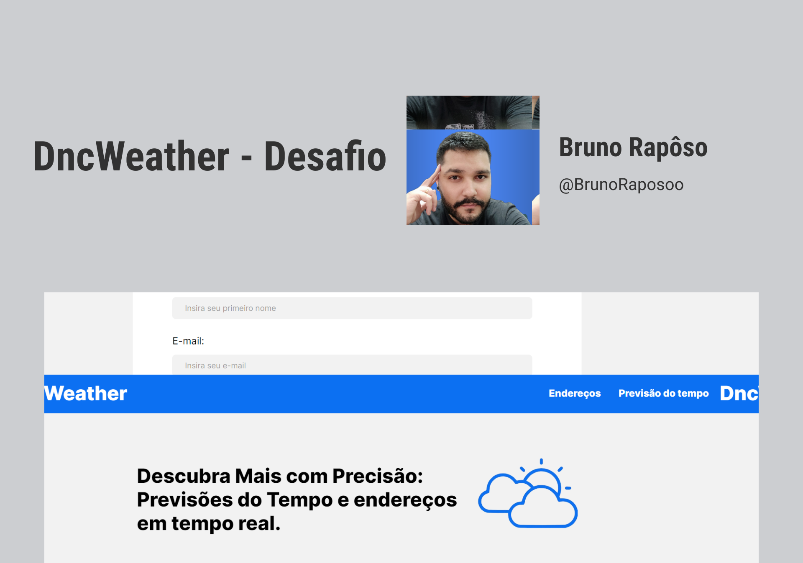

<h1 align="center"> Desafio 2 - DncWeather 🌦️</h1>

  <a href="#-tecnologias">Tecnologias</a>&nbsp;&nbsp;&nbsp;|&nbsp;&nbsp;&nbsp;
  <a href="#-projeto">Projeto</a>&nbsp;&nbsp;&nbsp;|&nbsp;&nbsp;&nbsp;
  <a href="#-layout">Layout</a>&nbsp;&nbsp;&nbsp

 

  

## 🚀 Tecnologias

Esse projeto foi desenvolvido com as seguintes tecnologias:

- [HTML](https://developer.mozilla.org/pt-BR/docs/Web/HTML)
- [CSS](https://developer.mozilla.org/pt-BR/docs/Learn/Getting_started_with_the_web/CSS_basics)
- [JavaScript](https://www.javascript.com/)

## 💻 Projeto

Projeto desenvolvido para criar uma página que forneça informações sobre endereço e meteorologia utilizando API [ViaCEP](https://viacep.com.br/) e [Open-Meteo](https://open-meteo.com/)

Para acessar o projeto [CLIQUE AQUI](https://dazzling-custard-4f6da6.netlify.app/)  
Ou Acesse o site https://dazzling-custard-4f6da6.netlify.app/

## 🔖 Layout

Você pode visualizar o layout do projeto através [DESSE LINK](https://www.figma.com/file/cPLXzs1LNGDRDluE5pr1z4/Desafio-02%3A-Desafio%3A-Desenvolva-tela-funcional-com-consumo-de-API%C2%B4s?type=design&node-id=0-1&mode=design&t=NMRKVrk8QJJjiCpn-0). É necessário ter conta no [Figma](https://figma.com) para acessá-lo.